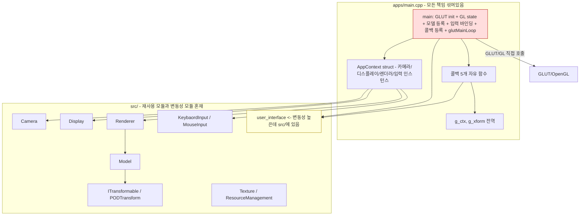
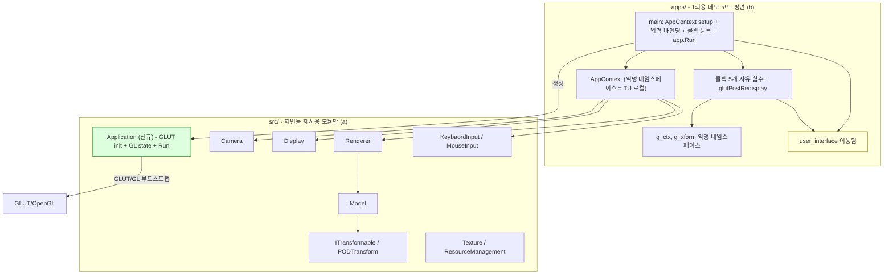
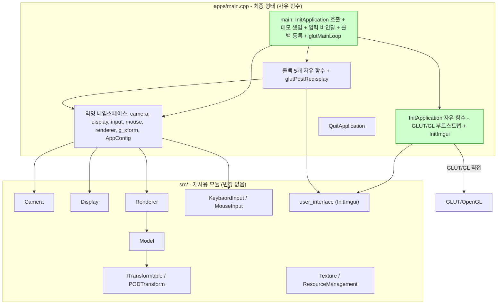

# App 구조 개선 회고

## 결론 (TL;DR)

**Application을 4번 재설계한 끝에 자유 함수로 회귀했다.** 회귀는 실패가 아닌 *수렴 과정*이었다.

| 단계 | 모양 | 폐기 이유 |
|---|---|---|
| 1차 | sb7 형 — `BaseApplication` 상속 + 가상 메서드 | 상속이 확장성을 가둔다는 철학과 충돌 |
| 2차 | Strategy — `Application` + `IAppHooks` + `MyDemo` | 1회용 콘텐츠에 인터페이스는 과투자 |
| 3차 | 얇은 `Application` 클래스 + 자유 함수 콜백 + `AppContext` struct | **상태 없는 클래스 = 절차의 불필요한 객체화** |
| **4차 (최종)** | **`InitApplication` 자유 함수 + 익명 네임스페이스 평면 변수** | 더 줄일 게 없는 지점 |

### 4가지 큰 교훈

1. **상태 없는 클래스는 함수다.** 멤버가 없는 `class`는 OOP처럼 보이는 절차일 뿐.
2. **YAGNI는 진동을 통해 발견된다.** 한 번에 정답에 닿는 경우는 드물다. 과투자 -> 회귀의 반복으로 본질에 도달한다.
3. **프레임워크의 패턴은 프레임워크에서 빌려라.** 1회용 데모에 sb7/Magnum의 패턴을 이식하면 임피던스 미스매치만 남는다.
4. **GLUT는 함수 포인터 API다.** 그것을 OOP로 감싸는 시도는 모두 트램폴린 비용을 동반한다.

### 살아남은 자산
- `src/`에 정성껏 다듬은 재사용 모듈 (특히 `Texture`/`ResourceManagement` — RAII + 캐시 + 이동 의미론)
- `apps/main.cpp`에 가장 단순한 형태로 정리된 데모 코드
- 다음 프로젝트를 위한 직관: *"무엇을 만들지에 따라 패턴을 정한다."*

---

## Part 1 — Texture & Resource 모듈 (살아남은 것)

### 시작
`glTexImage2D(target, 0, internal_format, w, h, 0, format, ...)`에서 **`internal_format` (GPU 저장 형식)** vs **`format` (CPU 입력 형식)** 의 차이를 묻는 질문이 입구.

### 거쳐간 의사결정
1. **단일 자유 함수 -> `Texture`(RAII) + `ResourceManagement`(unordered_map 캐시)** 구조로 진화
2. **5법칙 정합성**: 복사 `= delete`, 이동 `noexcept` (표준 컨테이너의 강한 예외 보장 + `move_if_noexcept` 분기)
3. **캐시 패턴**: `find` 후 반복자 재사용, `emplace`의 `pair<iterator, bool>` 직접 활용 — 이중 해시 회피
4. **실패는 캐시에 넣지 않기** — `textureID == 0` 체크로 좀비 텍스처 차단
5. **채널 분기 정책**: RGB/RGBA만 대응 (1·2채널 미지원)

### 한 번씩 컴파일을 막은 시행착오
- `try { ... }` 뒤 `catch` 누락
- `image` 변수의 try 블록 스코프 누수 (다음 줄에서 미정의 식별자)
- `textures.emplace(path, );` 인자 누락
- `format = (format < 4) ? GL_RGB : format` — GLenum 값(`0x1907`)과 채널 수(`4`) 비교의 의미 충돌
- 헤더 `<GL/freeglut.h.h>` 오타
- 헤더 include guard 부재

### 미해결 — 인지만 (D 영역)
- `glPixelStorei(GL_UNPACK_ALIGNMENT, 1)` — RGB(3채널) 폭이 4의 배수 아닐 때 가로줄
- `internal_format` 알파 보존 — RGBA 이미지에 기본 `GL_RGB` 인자 들어오면 알파 손실
- `STB_IMAGE_IMPLEMENTATION` 단일 TU 보장
- imguizmo upstream의 `CMakeLists.txt` 추가로 인한 `cmake/Dependency.cmake:38` 충돌

---

## Part 2 — Application 아키텍처의 여정과 회귀

### 출발 직관
`apps/main.cpp`에서 *"콜백은 다형적, 부트스트랩은 보일러플레이트"* 라는 분리 욕구.

### 회귀의 본질

3차에서 만들어진 `Metahuman::Application`을 들여다보면:
- 멤버 데이터: **0개**
- `Run()`: `glutMainLoop()` 한 줄
- 생성자: GLUT init 8줄
- 파괴자: `default`
- 복사/대입: `delete`

-> **상태 없는 클래스 = 절차의 불필요한 객체화.**

### 왜 매 단계가 합리적이었는데도 회귀했나

YAGNI가 한 발 늦게 작동했다. 매번 "이전보다 단순하게"의 반복이었고, 4차에서 멈춘 건 **더 줄일 게 없는 지점**에 도달했기 때문.

| 단계 | 추상화 수준 | 본질 |
|---|---|---|
| 1차 (상속) | 가장 무거움 | 프레임워크 척하기 |
| 2차 (인터페이스) | 중간 | 다형성 척하기 |
| 3차 (얇은 클래스) | 낮음 | OOP 척하기 |
| **4차 (자유 함수)** | **0** | **GLUT의 본 모습 그대로** |

근본 원인: **시작 위치가 너무 위였다.** 분석 시 sb7/Magnum/Godot의 패턴을 참조했지만, 그것들은 *프레임워크*고 본 프로젝트는 *1회용 데모*다. 임피던스 미스매치를 충분히 무겁게 가중치 두지 못했다.

### 살아남은 것 / 죽은 것

| 항목 | 운명 |
|---|---|
| `Camera`, `Display`, `Renderer`, `Model`, `Inputs` | 살아남음 (a) — 그대로 |
| `Texture`, `ResourceManagement` | 살아남음 (a) — 정성껏 |
| `user_interface` (`InitImgui` 등) | 살아남음 (b) — `src/` 위치 유지, 이름만 정리 |
| `AppContext` struct | **죽음** — 익명 네임스페이스의 평면 변수들로 분해 |
| `Metahuman::Application` 클래스 | **죽음** — `InitApplication` 자유 함수로 회귀 |
| `IAppHooks` / `Scene` 추상화 | 시도조차 안 됨 (1차에서 폐기) |

---

## 다이어그램

### Before — 출발점

### 3차 시도 (After) — 폐기된 설계

`Application` 클래스로 GLUT 부트스트랩을 흡수, `user_interface`를 `apps/`로 이동, `AppContext`를 익명 네임스페이스로 캡슐화하려 했던 안. **상태 없는 클래스라는 점이 드러나 폐기.**

### 최종 — 4차 회귀

`Application` 클래스 -> `InitApplication` 자유 함수, `AppContext` struct -> 익명 네임스페이스 평면 변수, `user_interface`는 `src/`에 그대로 두고 `InitImgui`로 이름만 정리.

---

## 마무리

회귀는 *"리팩토링을 정면으로 부정"* 한 게 아니다. **여러 설계를 거쳐 가장 정직한 형태에 도달한 것**이다.

핵심은 **사용자가 직접 그 결론에 도달했다는 점** — 처음부터 답을 받았다면 4단계의 사고를 거치지 않았을 것이고, 다음 프로젝트에서 똑같은 진동을 다시 겪었을 것이다. 4번의 시도가 곧 학습 자체였다.
