## 메타 휴먼 발표 자료

<div align=center>
    <a href="https://www.youtube.com/watch?v=BvLO3C3dpKo&list=PLIMQzWccmG7YWLpXeiQRaBV94vfIJc2Ex&index=19"></a>
    <h5>케로로 모델 (손 제외) 팔, 다리, 얼굴, 몸통 레퍼런스</h5>
</div>

---

#### 목차
0. 시연 영상 결과
1. 파라메트릭 서피스
2. Implicit Surface
3. 텍스쳐 매핑
4. 알파 텍스쳐
5. 스카이 박스
6. 조명
7. JSON 기반 위치 Save/Load
8. 지형 Ground
9. UI / ImGui 제어
10. 그 외 사용한 대표 메서드

---

> ### 📄 0. 시연 영상 결과

<div align=center>
    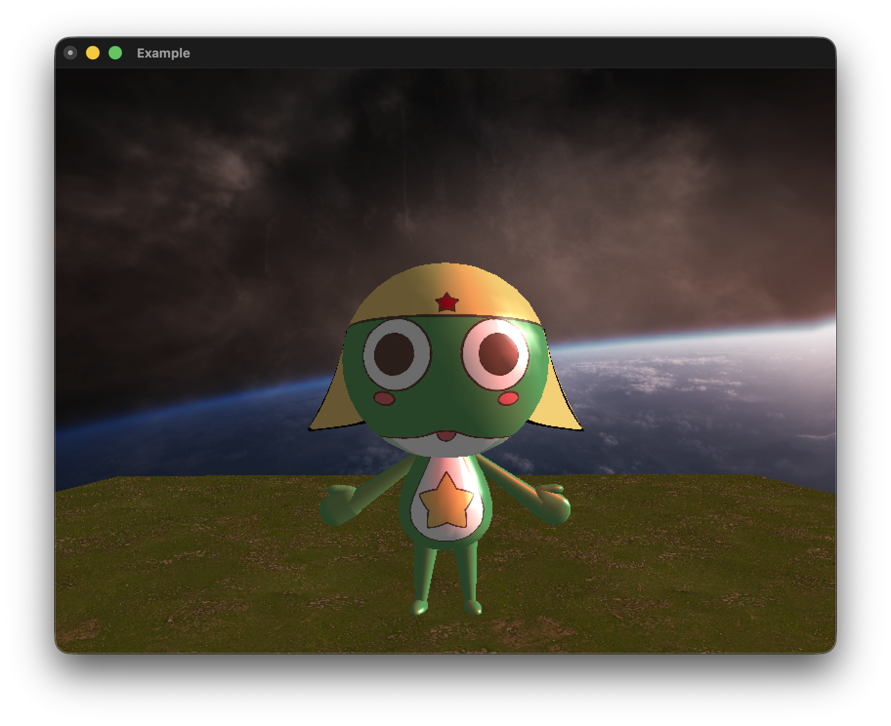
    
    <h5></h5>
</div>

---

> ### 📄 1. Parametric Surface

---

#### 더 높은 자유도의 메시 조작을 위해 Parametric Surface 도입.

##### ① 코드로 일일이 점을 찍는 건 정말 말도 안 됩니다 (CCW, Normal) 등등등 고려할 게 너무 많습니다.

##### ② 설령 가능하더라도 조금이라도 모양을 바꾸고 싶어도 눈 빠지도록 자료구조를 쳐다봐야 할 것입니다.

<div align=center>
    <a href="https://youtube.com/shorts/nt-y5iBrIrs?si=kH1hP2Zdd3lLf6Vr"></a>
    <h5>파라메트릭 서피스를 사용하게 된 동기.</h5>
</div>


---

#### 1. 파라메트릭 서피스 개요

##### ① 좋은 메시 10가지 체크리스트

| Checklist                | Parametric Surface |
| ------------------------ | :----------------: |
| Accurate                 |        Yes         |
| Concise                  |        Yes         |
| Intuitive Specification  |        Yes         |
| Local Support            |        Yes         |
| Affine Invariance        |        Yes         |
| Arbitrary Topology       |         No         |
| Guaranteed Continuity    |        Yes         |
| Natural Parameterization |        Yes         |
| Efficient Display        |        Yes         |
| Efficient Intersection   |         No         |

---

#### 2. Surface Function

##### 동일한 $u$, $v$ 가 들어오더라도, 모델의 모양은 천차만별 
$$ 
x = f_x(u, v) \quad y = f_y(u, v) \quad z = f_z(u, v)
$$

##### ① 3. 물방울 `Surface Function`
* `KeroroBody`를 구현하기 위함 `class ParametricGeometry`
`SurfaceFunction` 오버라이딩.

<div align=center>
    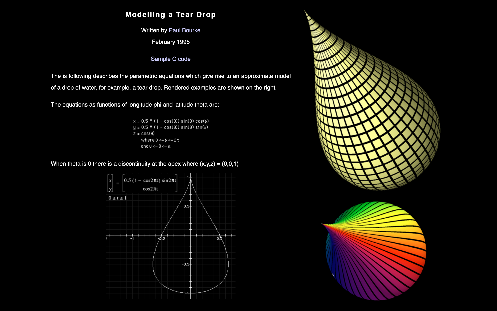
    <h5>https://paulbourke.net/geometry/teardrop/</h5>
</div>

```cpp
virtual glm::vec4 SurfaceFunction(double u, double v) const override
{
	const float phi = (float)(u);
	const float theta = (float)(v);
	const float hR = 0.5f * (1.0f - cosf(theta)) * sinf(theta);
	return glm::vec4(hR * cosf(phi),
	                 cosf(theta), // (Y축 높이)
	                 hR * sinf(phi),
	                 1.0f);
}
```

##### ② 4. 쌍곡면 SurfaceFunction 

* `KeroroHat`를 구현하기 위함 class ParametricGeometry
SurfaceFunction 오버라이딩.

<div align=center>
    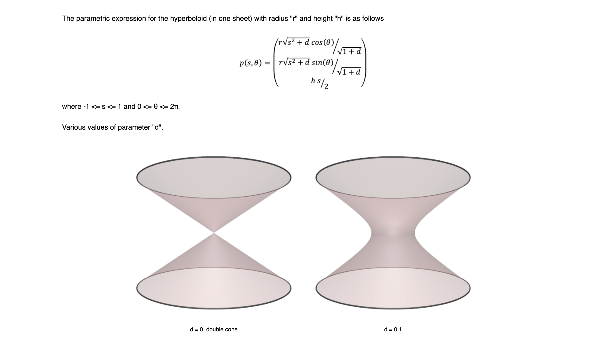
    <h5>https://paulbourke.net/geometry/hyperboloid/</h5>
</div>


```cpp
virtual glm::vec4 SurfaceFunction(double u, double v) const override
{
	const float phi = (float)(u);
	const float s = (float)(v);
	const float d = hyper.shape;
	const float r = hyper.radius * sqrtf(d + s * s) / sqrtf(d + 1.0f);
	return glm::vec4(r * cosf(phi),
	                 -hyper.height * s, 
	                 r * sinf(phi),
	                 1.0f);
}
```


---

#### 3. 실제 코드에서는 어떻게 구현하는가?

##### 레퍼런스
* https://www.youtube.com/watch?v=VGG-thrIMws&list=PLxpdybrffYlPqkCyvvLfvwsaB7CB1r0pV&index=32
* https://github.com/satchamo/Mobius-Strip/blob/master/mobius.c
* https://paulbourke.net/geometry/heart/heart.cpp

##### ① `class Parametric Geometry` 생성자.

1. $u$ & $v$ 
   1. 각각 정의역을 추가로 입력을 해야 합니다.
        * $u \in [u_\text{start}, u_\text{end}]$
        * $v \in [v_\text{start}, v_\text{end}]$
   2. 얼마나 촘촘히 쪼갤 것 (iterate) 할지. 해상도 값 입력
        * $u_{res} \in [\text{0}, \infty)$
        * $v_{res} \in [\text{0}, \infty)$
         * 이게 곧 Quad 메시의 개수가 된다. 
           $u_{res} \times v_{res} = \text{Quads Count}$

##### ② `Virtual SurfaceFunction(u, v)`

* Surface Function이 곧 모델의 모양을 결정하는 아주 중요한 함수다.
OOP 방식으로 구현하려는 모델마다 다른 SurfaceFunction을 다형적으로 구현하는 
클래스 디자인을 선택함.
* 대표적으로 위에서 설명한 : "물방울", "쌍곡면"

##### ③ `3D Modeling`

1. **정점 벡터 생성하기** : $u_{res} \times v_{res} = \text{Quads Count}$이므로
    정점들은 그보다 하나씩 더 많아야 한다.
    ```cpp
    size_t uCount = uRes + 1;
	size_t vCount = vRes + 1;
	vertices.resize(uCount * vCount);
	normals.resize(uCount * vCount);
	texCoords.resize(uCount * vCount);
    ```
2. **$\Delta u$, $\Delta v$ 생성**
    $$
    \Delta u = \frac{u_{end} - u_{start}}{u_{res}}
    $$
    ```cpp
    du = (uEnd - uStart) / (double)(uRes);
	dv = (vEnd - vStart) / (double)(vRes);
    ```

3. **이터레이팅**
   1. **position** : $u_{start} + \Delta u * \text{IterCount}$
        * $u, v$ 별로 $\Delta u, \Delta v$ 만큼 한 칸 한 칸씩 위상을 옮겨가면서
        정점 데이터를 쌓아나가면 된다.
   2. **texCoord** : 텍스쳐 uv 좌표는 정규화된 값을 가지고 있으므로 정의역은 $[0, 1]$이다.
        * 따라서 $\frac{IterCount}{Resolution}$ 이 UV 텍스쳐 좌표가 됩니다.
   3. **normals** : 두 **접선 벡터(= 편미분)를 외적**해 법선을 구한다.
        * 점 $S(u,v)$ 의 $u$·$v$ 방향 접선이 접평면을 이루고, 그에 수직인 게 법선
          $$
          S_u \approx \frac{S(u+\epsilon_u,\,v) - S(u,\,v)}{\epsilon_u}, \quad \\
          S_v \approx \frac{S(u,\,v+\epsilon_v) - S(u,\,v)}{\epsilon_v}, \quad \\
          \vec{n} = \frac{S_u \times S_v}{\lVert S_u \times S_v \rVert}
          $$

        ```cpp
        const glm::vec4 pu = SurfaceFunction(u + epsU, v);
        const glm::vec4 pv = SurfaceFunction(u, v + epsV);
        const glm::vec3 dPdu = glm::vec3(pu - vertices[idx]); // S_u
        const glm::vec3 dPdv = glm::vec3(pv - vertices[idx]); // S_v
        const glm::vec3 cross = glm::cross(dPdu, dPdv);
        const float len = glm::length(cross);
        normals[idx] = (len > 1e-6f) ? (cross / len) : glm::vec3(0, 1, 0); // 1e-6 = 퇴화 판정
        ```

> ### 📄 2. Implicit Surface

#### Glut에서 지원하는 `Quadric` 객체를 사용하여 "구", "캡슐", "원기둥" 구현

$$
F(x, y, z) = 0 \quad \text{식을 만족하는 해를 도형의 곡면으로 사용}
$$

##### ① Quadric 초기화 

##### `GLUquadric* quadric = gluNewQuadric();` 
* 곡면(quadric) 객체 생성
##### `gluQuadricDrawStyle(quadric, GLU_FILL);` 
* wireframe이 아닌 면으로 채워서 렌더
##### `gluQuadricNormals(quadric, GLU_SMOOTH);` 
* 정점별 법선을 생성해 면 경계를 부드럽게(smooth shading)
##### `gluQuadricTexture(quadric, GL_TRUE);` 
* 텍스쳐 **좌표(UV)를 자동 생성**
##### `gluQuadricOrientation(quadric, GLU_OUTSIDE);` 
* 법선을 바깥쪽으로 향하게 설정 (안쪽이면 GLU_INSIDE)

##### ② Surface 함수

##### `gluCylinder(quadric, bodyRadius, footRadius, length, slices, stacks);`

* 인풋
    * `bodyRadius, footRadius` : 상단 반지름과, 바닥 반지름
    * `length` : 원기둥의 높이
    * `slices, stacks` : $u_{res} = \text{slice}$ , $v_{res} = \text{stack}$

##### `gluSphere(quadric, radius, slices, stacks);`

* 인풋
    * `radius` : 구의 반지름
    * `slices, stacks` : $u_{res} = \text{slice}$ , $v_{res} = \text{stack}$

##### ③ 복합 Surface 제작
##### glClipPlane(GL_CLIP_PLANE0, {...});
1. 위쪽 반구
    ```cpp
	glPushMatrix();
	glTranslated(0.0, 0.0, 1.0);
	glClipPlane(GL_CLIP_PLANE0, {0, 0, 1, 0});
	glEnable(GL_CLIP_PLANE0);
	gluSphere(quadric, 1.0, slices, stacks);
	glDisable(GL_CLIP_PLANE0);
	glPopMatrix();
    ```
2. 아래쪽 반구 그리기
    ```cpp
   	glPushMatrix();
	glClipPlane(GL_CLIP_PLANE0, {0, 0, -1, 0});
	glEnable(GL_CLIP_PLANE0);
	gluSphere(quadric, 1.0, slices, stacks / 2);
	glDisable(GL_CLIP_PLANE0);
	glPopMatrix();
    ```

----

> ### 📄 3. 텍스쳐 매핑

#### 텍스쳐를 늘리고 줄여서 올바르게 배치되도록 하자.
##### 이렇게 함으로써, 심미적으로 올바른 위치에 텍스쳐를 배치할 수 있습니다.
* 여기서 파라메트릭 서피스의 장점이 드러나는데 
바로 **"Natural Parameterization"** 가 매우 손쉽다는 점입니다.

---

#### 1. UV Mapping 

<div align=center>
    
    <h5></h5>
</div>

##### `glEnable(GL_TEXTURE_2D);`

* glut에서 텍스쳐 매핑을 활성화하는 함수

##### `glBindTexture(GL_TEXTURE_2D, id);`

* 텍스쳐 바인딩을 통해 실제 모델에 텍스쳐를 그리게 하는 함수

##### `glMatrixMode(GL_TEXTURE);`
* UV 변환은 GL_TEXTURE 매트릭스 스택에 적용한다.
  모델 자체의 위치를 변경하는 `glXXX` 시리즈는 동일하다.
  ```cpp
  void Draw() override {
    ...
    glPushMatrix()
    glLoadIdentity();
    glTranslatef(uv.offset.x, uv.offset.y, 0.0f); // UV Offset 조절
    glRotatef(uv.rotationDeg, 0.0f, 0.0f, 1.0f); // UV의 외전 조절
    glScalef(uv.scale.x, uv.scale.y, 1.0f); // UV의 넓게 펴 바르는 등. Ratio 조절
    ...
  }
  ```

> ### 📄 4. 알파 텍스쳐

<div align=center>
    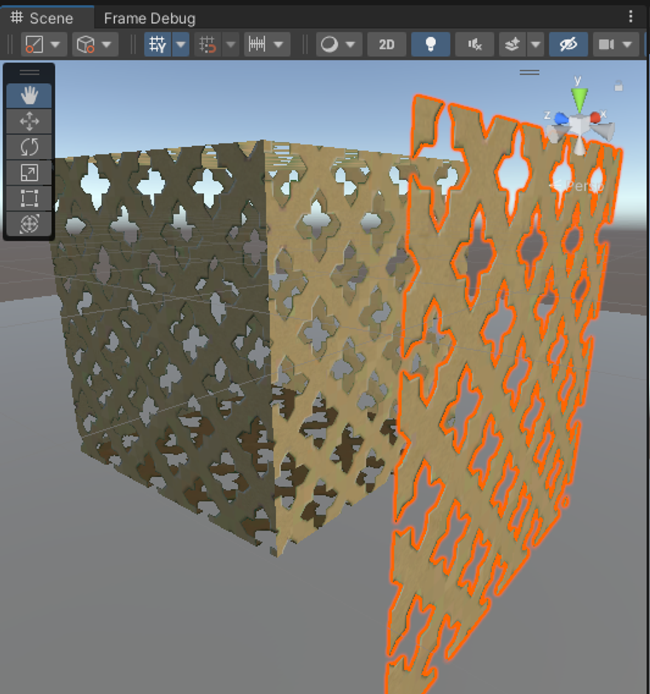
    <h5></h5>
</div>

#### 케로로의 항공 모자 모양대로 정점을 찍을 수는 없습니다. <br> *기하적인 함수가 존재하는가 보장도 할 수 없습니다.*
##### 따라서 케로로의 모자를 추상적으로 생각해서, <br> 그림이 그려져야 하는 부분, 그릴 필요 없는 부분을 Alpha 값으로 제거하는 기법 선택

#### 1. 알파 텍스쳐의 API


##### ① `glEnable(GL_ALPHA_TEST)`

* 알파 테스트란, $\alpha$ 값을 스레숄딩 값으로 불투명한 면 제외 폐기를 하도록 하는 기능
* 그러한 옵션을 활성화하는 API임.

##### ② `glAlphaFunc(GL_GREATER, 0.9f);`

* 어느 상황에서 폐기해야 하나에 대한 함수를 설정할 수 있고,
* 이는 $ \alpha \gt 0.9$ 라면 색상 폐기하겠다는 것을 설정.

##### ③ `glDisable(GL_ALPHA_TEST);`
* Model을 Draw 하고 나면 다른 GL Context의 오염을 막기 위해 명시적으로 해제해 줘야 합니다.

----

> ### 📄 5. 스카이 박스

<div align=center>
    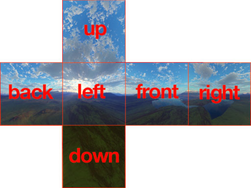
    <h5>Skybox 개념 예시 이미지</h5>
</div>

<div align=center>
    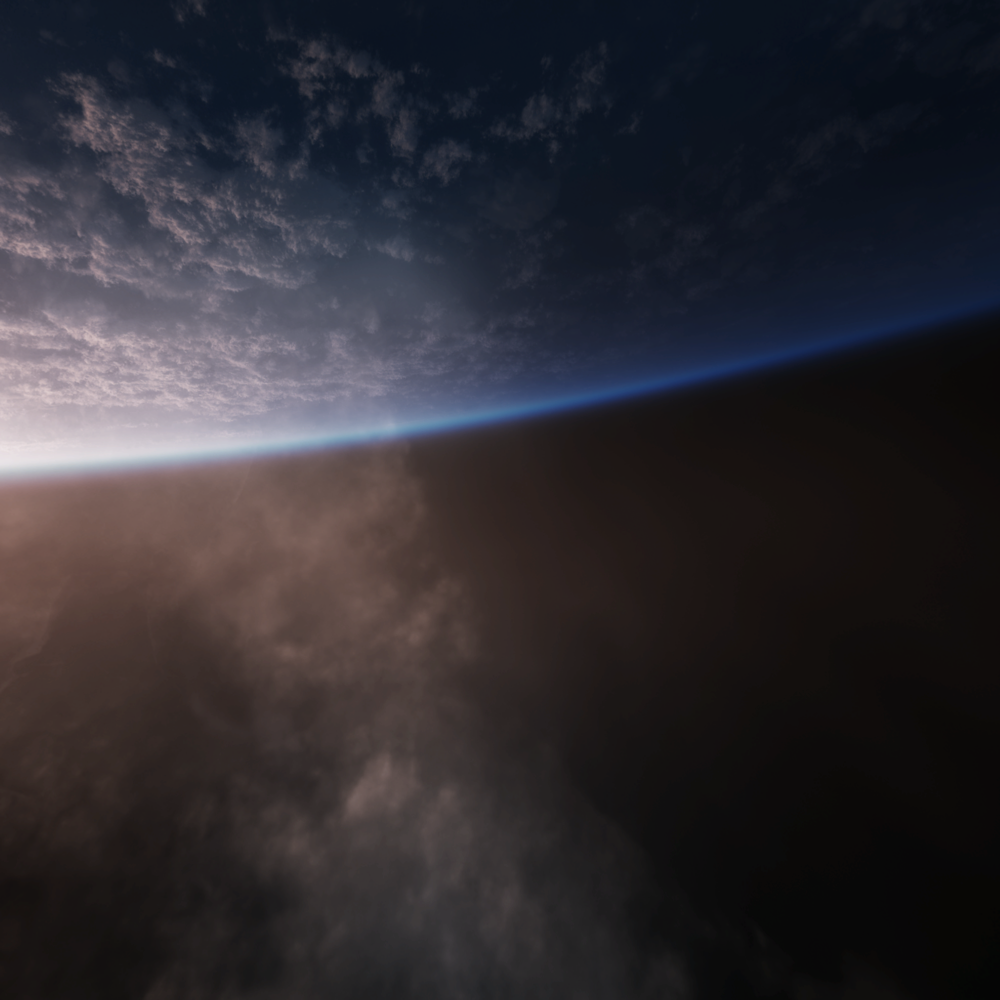
    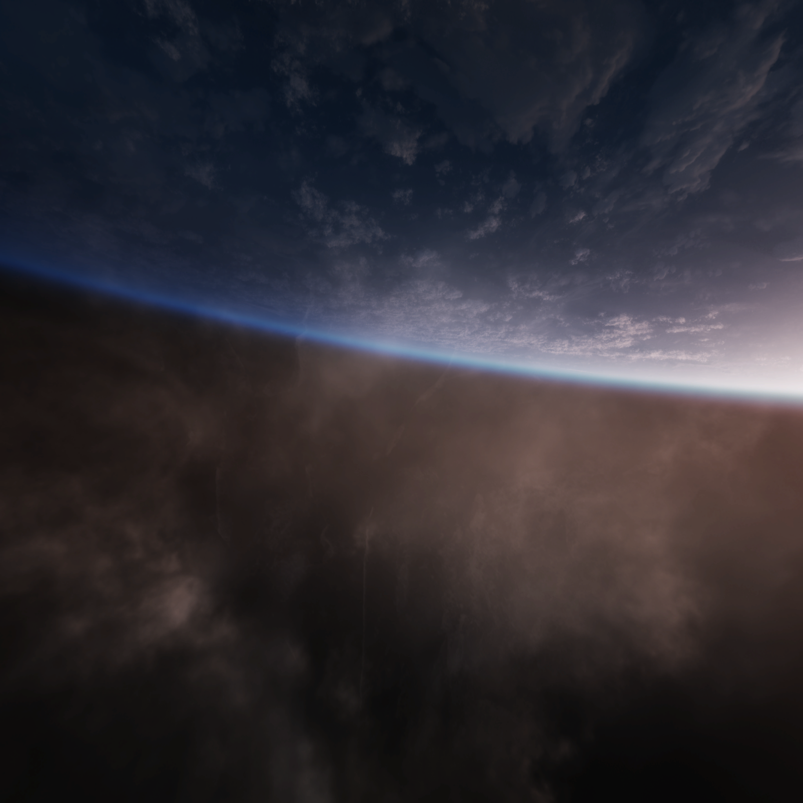
    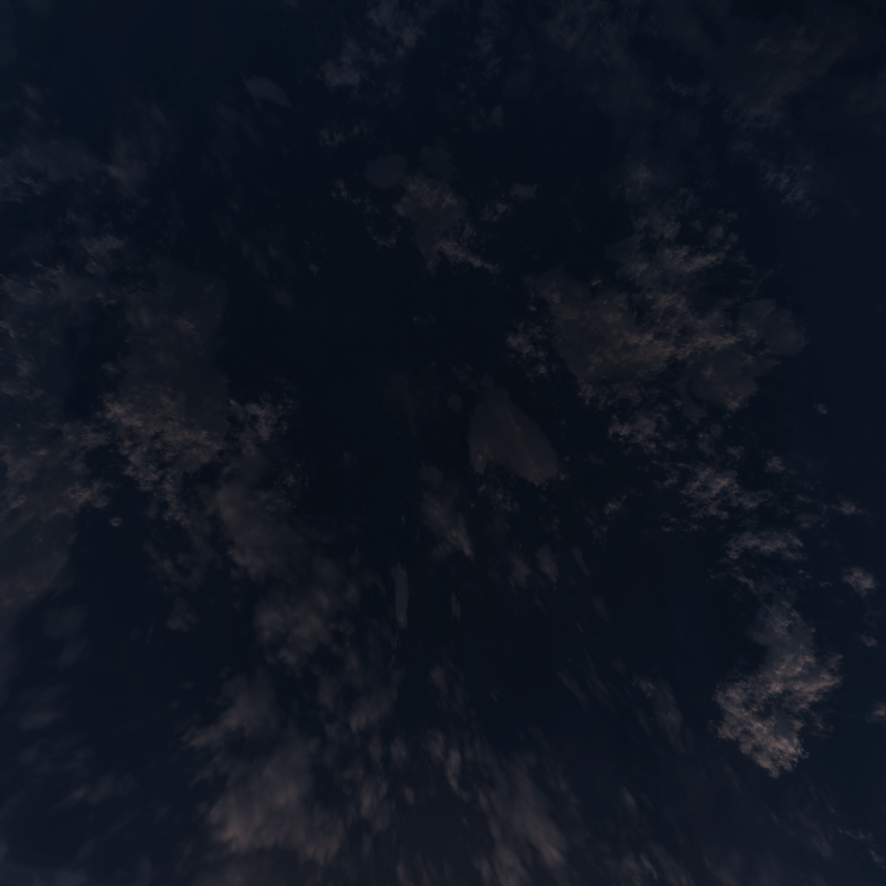
    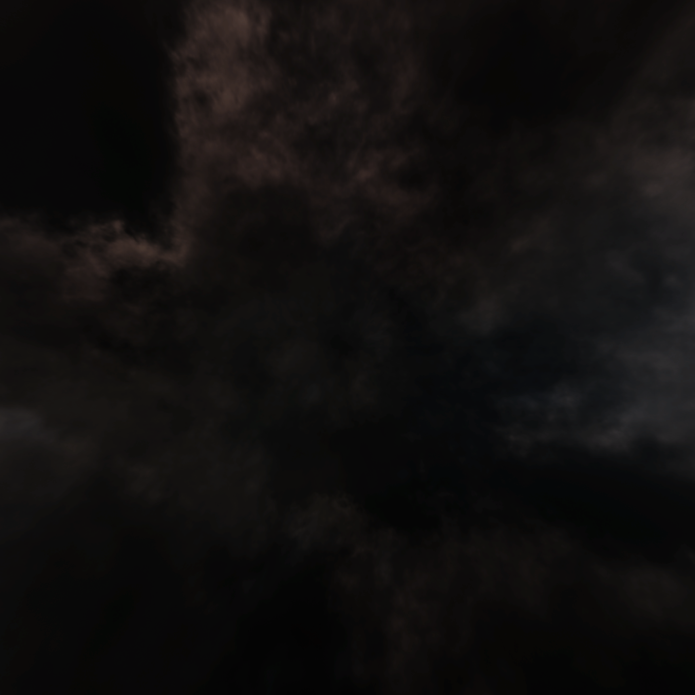
    
    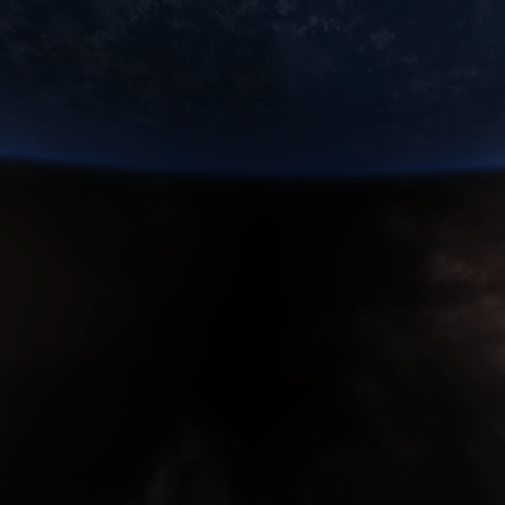
    <h5>사용한 Skybox 텍스쳐 6장</h5>
</div>

#### 1. Skybox를 가장 먼저 렌더링

##### 배경은 실제 모델보다 뒤에 있어야 하므로, 매 프레임 모델 렌더링 전에 먼저 그립니다.

```cpp
g_skybox.Draw();
g_ground.Draw();
g_ground2.Draw();
g_lighting.ApplySunLight();
g_lighting.ApplyPointLight((float)glutGet(GLUT_ELAPSED_TIME) * 0.001f);

renderer.Render(camera);
```

##### Skybox 내부에서는 조명과 깊이 테스트를 잠시 끄고, 6장의 텍스쳐를 큐브의 각 면에 매핑합니다.

* 배경은 조명 영향을 받으면 안 되므로 `glDisable(GL_LIGHTING)`을 사용했습니다.
* 카메라와 모델보다 항상 뒤쪽 배경처럼 보이도록 `glDisable(GL_DEPTH_TEST)`를 사용했습니다.
* 이전 OpenGL 상태가 다른 모델 렌더링에 영향을 주지 않도록 `glPushAttrib`, `glPopAttrib`로 상태를 복구합니다.

```cpp
glPushAttrib(GL_ENABLE_BIT | GL_DEPTH_BUFFER_BIT);

glDisable(GL_DEPTH_TEST);
glDisable(GL_LIGHTING);
glEnable(GL_TEXTURE_2D);

...

glPopAttrib();
```

##### 또한 Skybox의 방향이 조명 방향과 어색하게 맞지 않는 문제가 있어, Y축 기준으로 180도 회전시켜 장면 방향을 맞췄습니다.

```cpp
glPushMatrix();
glRotatef(180.0f, 0.0f, 1.0f, 0.0f);
```


----

> ### 📄 6. 조명

#### Directional Light와 공전하는 Point Light를 분리해서 장면의 입체감을 만들었습니다.

<div align=center>
    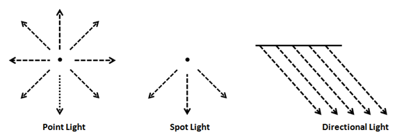
    <h5>조명 벡터 구성</h5>
</div>

##### OpenGL 고정 파이프라인의 Phong reflection model을 사용했고, `GL_SMOOTH`로 정점 조명 결과를 보간하는 Gouraud shading 방식으로 렌더링했습니다.

#### 1). Diffuse / Specular 조명 수식

##### Diffuse는 표면 법선과 빛 방향이 얼마나 같은 방향을 보는지로 결정됩니다.

$$
I_d = k_d I_l \max(\vec{N} \cdot \vec{L}, 0)
$$

##### Specular는 반사 벡터와 시선 벡터가 가까울수록 강해집니다. `shininess` 값이 커질수록 하이라이트가 더 작고 날카로워집니다.

$$
\vec{R} = 2(\vec{N} \cdot \vec{L})\vec{N} - \vec{L}
$$

$$
I_s = k_s I_l \max(\vec{R} \cdot \vec{V}, 0)^n
$$

##### 최종적으로 Ambient, Diffuse, Specular 항을 더해 표면의 조명 색을 계산합니다.

$$
I = I_a k_a + I_d + I_s
$$

* $\vec{N}$ : 표면 법선
* $\vec{L}$ : 빛 방향
* $\vec{V}$ : 카메라를 향하는 시선 방향
* $\vec{R}$ : 반사 벡터
* $n$ : `materialShininess`

<div align=center>
    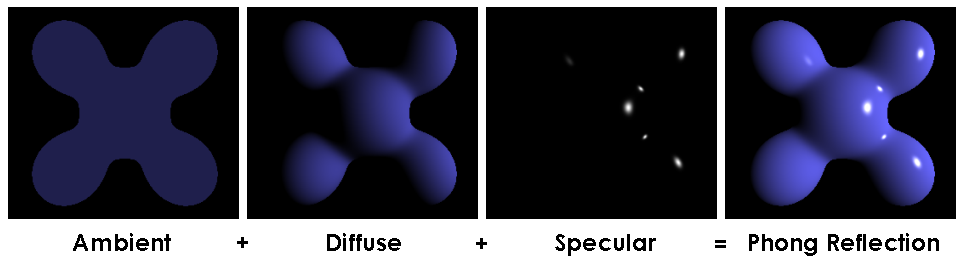
    <h5>Phong reflection model</h5>
</div>

#### 2). Directional Light

##### 태양광처럼 방향만 있고 위치는 무한히 멀리 있는 빛으로 사용했습니다. OpenGL 고정 파이프라인에서는 위치 벡터의 `w` 값을 `0.0f`로 주면 방향광으로 동작합니다.

$$
\theta = \text{sunThetaDeg} \cdot \frac{\pi}{180}, \quad
\phi = \text{sunPhiDeg} \cdot \frac{\pi}{180}
$$

$$
\vec{L}_{sun} =
\left(
\cos\theta\cos\phi, \\
\sin\theta, \\
\cos\theta\sin\phi, \\
0
\right)
$$

```cpp
const GLfloat sunDirection[] = {
    horizontal * std::cos(phi),
    std::sin(theta),
    horizontal * std::sin(phi),
    0.0f
};

glLightfv(GL_LIGHT0, GL_POSITION, sunDirection);
```

#### 3). Point Light

##### Point Light는 `w = 1.0f`로 설정해 실제 위치를 가진 빛으로 만들었습니다. 시간에 따라 `cos`, `sin`으로 XZ 평면을 회전하게 해서 케로로 주변을 공전합니다.

$$
\alpha(t) = t \cdot \omega
$$

$$
P_{point}(t) =
\left(
r\cos\alpha(t), \\
h, \\
r\sin\alpha(t), \\
1
\right)
$$

* $r$ : `pointRadius`
* $h$ : `pointHeight`
* $\omega$ : `pointAngularSpeed`

```cpp
const float angle = elapsedSeconds * value.pointAngularSpeed;
const GLfloat pointPosition[] = {
    std::cos(angle) * value.pointRadius,
    value.pointHeight,
    std::sin(angle) * value.pointRadius,
    1.0f
};

glLightfv(GL_LIGHT1, GL_POSITION, pointPosition);
```

#### 4). ImGui 조명 컨트롤

##### 조명값은 `LightingValue` 구조체에 모으고, ImGui 패널에서 방향광, 재질 스페큘러, 포인트 라이트 값을 조절할 수 있게 했습니다.

```cpp
ImGui::DragFloat("Theta", &lighting.sunThetaDeg, 0.5f);
ImGui::DragFloat("Phi", &lighting.sunPhiDeg, 0.5f);
ImGui::ColorEdit3("Ambient", lighting.sunAmbient);
ImGui::ColorEdit3("Diffuse", lighting.sunDiffuse);
ImGui::ColorEdit3("Specular", lighting.sunSpecular);
```

##### 실제 프로젝트에서 사용한 기본 조명 값은 다음과 같습니다.

| 항목 | 값 |
| ---- | ---- |
| Sun Theta | `21.0` |
| Sun Phi | `0.0` |
| Sun Ambient | `(0.22, 0.22, 0.22)` |
| Sun Diffuse | `(0.88, 0.86, 0.80)` |
| Sun Specular | `(1.0, 1.0, 1.0)` |
| Material Specular | `(1.0, 1.0, 1.0)` |
| Shininess | `64.0` |
| Point Diffuse | `(1.0, 0.0, 0.0)` |
| Point Specular | `(1.0, 0.0, 0.0)` |
| Point Radius | `3.0` |
| Point Height | `0.8` |
| Point Angular Speed | `1.5` |

---

> ### 📄 7. JSON 기반 위치 Save/Load

---


##### 모델의 위치, 회전, 스케일, UV, 파라메트릭 파라미터를 코드에 직접 박아두면 장면을 조금 바꿀 때마다 다시 컴파일해야 합니다.

##### 따라서 현재 장면 상태를 `resources/scene_state.json`에 저장하고, 프로그램 시작 시 다시 읽어와 같은 배치를 복원하도록 구현했습니다.

#### 1). 저장 대상

##### 전체 엔진 상태가 아니라, 모델 배치와 형상 복원에 필요한 값만 저장합니다.

* `selectedModelIndex` : 마지막으로 선택된 모델
* `id`, `type` : 모델 식별 정보
* `transform` : 위치, 회전, 스케일
* `uv` : 텍스쳐 offset, scale, rotation
* `parametric` : u/v 범위, 해상도
* `hyperboloid` : 모자 곡면의 radius, height, shape

#### 2). 모델 ID 기반 추가

##### 같은 타입의 모델이 여러 개 있을 수 있으므로, 모델 타입만으로는 특정 모델을 구분할 수 없습니다.

##### 그래서 `id + type` 조합으로 모델을 구분합니다. 이 구조 덕분에 UI에서 모델을 동적으로 추가해도 저장/로드 시 같은 모델 목록을 다시 구성할 수 있습니다.

#### 3). Save / Load 흐름

##### 저장할 때는 renderer 안의 실제 모델 상태를 읽어 JSON 파일로 출력합니다.

##### 로드할 때는 JSON 파일의 모델 목록을 읽고, 모델을 다시 생성한 뒤 저장된 transform, uv, parametric, hyperboloid 값을 적용합니다.

##### 파라메트릭 모델은 파라미터가 바뀌면 메시를 다시 생성해야 하므로, 로드 과정에서 저장된 파라미터를 적용해 최종 형상을 복원합니다.

##### 이 구현은 범용 JSON 파서가 아니라, 프로젝트에서 사용하는 고정된 `scene_state.json` 형식에 맞춘 저장/복원 기능입니다.

#### 4). 실제 저장된 JSON 예시

```json
{
  "version": 2,
  "selectedModelIndex": 10,
  "models": [
    {
      "index": 10,
      "id": 10,
      "type": "KeroroHat",
      "transform": {
        "translate": [0, 0.46, 0],
        "rotateDeg": [0, -101, 0],
        "scale": [1, 1, 1]
      },
      "parametric": {
        "uRange": [0, 6.28319],
        "vRange": [0.06, 0.5],
        "resolution": [89, 8]
      },
      "hyperboloid": {
        "radius": 2.3395,
        "height": 2.7,
        "shape": 0.2
      }
    }
  ]
}
```

##### 전체 JSON 중 `KeroroHat`만 발췌한 예시입니다.

---

> ### 📄 8. 지형 Ground

#### 케로로 모델이 공중에 떠 있는 것처럼 보이지 않도록 텍스쳐가 적용된 바닥 평면을 추가했습니다.

<div align=center>
    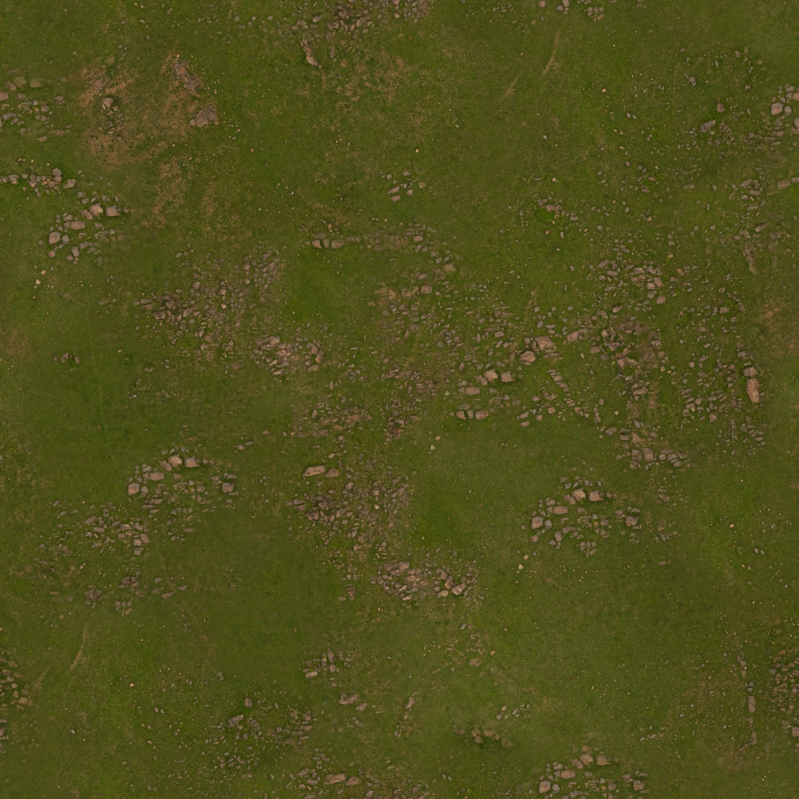
    
    <h5>사용한 원본 지형 텍스쳐</h5>
</div>

##### 하나의 큰 Quad에 지형 텍스쳐를 입히고, `GL_REPEAT`와 반복 UV 좌표를 사용해 넓은 바닥처럼 보이도록 했습니다.

##### 최종 장면에서는 두 장의 지형 텍스쳐를 서로 다른 높이에 배치해 바닥과 반대쪽 흙 질감을 함께 표현했습니다.

```cpp
Texture *terrain = g_rm.LoadTexture(TEXTURE::TEX_TERRAIN);
Texture *terrain2 = g_rm.LoadTexture(TEXTURE::TEX_TERRAIN2);
g_ground.SetTexture(terrain ? terrain->GetTextureID() : 0);
g_ground2.SetY(-2.5);
g_ground2.SetTexture(terrain2 ? terrain2->GetTextureID() : 0);
```

---

> ### 📄 9. UI / ImGui 제어

#### 모델 편집, 동적 모델 추가, 조명 수정, JSON 저장을 ImGui 패널에서 처리할 수 있도록 구성했습니다.

##### 1). 모델 상태 편집

##### 선택한 모델에 대해 위치, 회전, 스케일을 조절하고, 모델이 지원하는 기능에 따라 UV, Parametric, Hyperboloid 패널을 노출합니다.

```cpp
if (model)
    UITransformPanel(UI::PANEL::TRANSFORM, *model,
                     g_selectedModelIndex, modelLabels);

if (auto *uvt = dynamic_cast<IUVTransformable *>(model))
    UIUVPanel(UI::PANEL::UV, *uvt);
if (auto *geo = dynamic_cast<IParametricTransformable *>(model))
    UIParametricPanel(UI::PANEL::PARAMETRIC, *geo);
if (auto *hyp = dynamic_cast<IHyperboloidTransformable *>(model))
    UIHyperboloidPanel(UI::PANEL::HYPERBOLOID, *hyp);
```

##### 2). 조명 정보 수정

##### 방향광, 재질 스페큘러, 공전 Point Light의 색상과 움직임도 UI에서 조절할 수 있습니다.

```cpp
UILightingPanel(UI::PANEL::LIGHTING, g_lighting.GetValue());
```

##### 3). 동적 모델 추가

##### UI에서 모델 타입과 ID를 입력해 런타임 중 모델을 추가할 수 있도록 구현했습니다.

```cpp
if (UIModelAddPanel(
        UI::PANEL::MODELS,
        MODEL::MODEL_TYPES,
        (int)(sizeof(MODEL::MODEL_TYPES) / sizeof(MODEL::MODEL_TYPES[0])),
        g_addModelTypeIndex, g_addModelId))
{
    const ModelType type = ModelTypeFromIndex(g_addModelTypeIndex);
    if (AddModel(type, g_addModelId))
        g_addModelId = MakeDefaultModelId();
}
```

##### 모델 추가 시 `id` 중복을 막아 저장/로드 시 모델 식별이 꼬이지 않도록 했습니다. 실제 위치와 회전의 최종 상태는 JSON에 저장된 transform이 담당합니다.

##### 4). JSON 저장 버튼

##### Scene 패널의 저장 버튼을 누르면 현재 모델 상태를 `scene_state.json`에 기록합니다.

```cpp
const bool saveRequested = UIScenePanel(UI::PANEL::SCENE, GetSceneSavePath(), g_saveStatus);

if (saveRequested)
    g_saveStatus = SaveSceneState(GetSceneSavePath()) ? 1 : 0;
```

---

> ### 📄 10. 그 외 사용한 대표 메서드

<div align=center>
    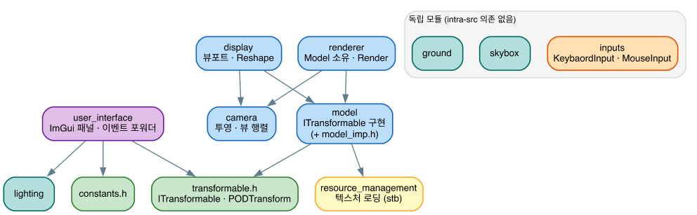
    <h5>모듈 분리 내역</h5>
</div>


----

# 감사합니다.

https://dogguyman.github.io/Computer-OpenGL-ComputerGraphics/

---
